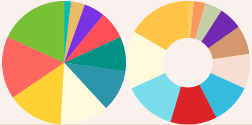

<!-- Improved compatibility of back to top link: See: https://github.com/othneildrew/Best-README-Template/pull/73 -->
<a name="readme-top"></a>
<!--
*** Thanks for checking out the Best-README-Template. If you have a suggestion
*** that would make this better, please fork the repo and create a pull request
*** or simply open an issue with the tag "enhancement".
*** Don't forget to give the project a star!
*** Thanks again! Now go create something AMAZING! :D
-->


<!-- PROJECT SHIELDS -->
<!--
*** I'm using markdown "reference style" links for readability.
*** Reference links are enclosed in brackets [ ] instead of parentheses ( ).
*** See the bottom of this document for the declaration of the reference variables
*** for contributors-url, forks-url, etc. This is an optional, concise syntax you may use.
*** https://www.markdownguide.org/basic-syntax/#reference-style-links
-->
[![Contributors][contributors-shield]][contributors-url]
[![Forks][forks-shield]][forks-url]
[![Stargazers][stars-shield]][stars-url]
[![Issues][issues-shield]][issues-url]
[![MIT License][license-shield]][license-url]
[![LinkedIn][linkedin-shield]][linkedin-url]

[](https://android-arsenal.com/api?level=21)


<!-- PROJECT LOGO -->
<br />
<div align="center">
  <a href="https://github.com/thilinakj/Compose_Pie_Chart_View">
    
  </a>

<h3 align="center">Kotlin Compose Pie Chart View</h3>

  <p align="center">
    Simple and Lightweight Pie Chart View library written with Kotlin Compose.
    <br />
    <a href="https://github.com/thilinakj/Compose_Pie_Chart_View"><strong>Explore the docs »</strong></a>
    <br />
    <br />
    <a href="https://youtu.be/EcaCr3ofbvo">View Demo</a>
    ·
    <a href="https://github.com/thilinakj/Compose_Pie_Chart_View/issues">Report Bug</a>
    ·
    <a href="https://github.com/thilinakj/Compose_Pie_Chart_View/issues">Request Feature</a>
  </p>
</div>

<!-- TABLE OF CONTENTS -->

<!-- ABOUT THE PROJECT -->
## About The Project

Simple and Lightweight Pie Chart View library written with Kotlin Compose. Currently support Filled Pie Chart and Donut shaped pie chart styles. Offers wide range of customizations to the users. Checkout usages for more info. 

### Built With

* [![Kotlin][Kotlin.js]][Kotlin-url]

### Installation

1. Add the JitPack repository to your root level `build.gradle` file.

   Groovy
```kotlin
dependencyResolutionManagement {
	repositoriesMode.set(RepositoriesMode.FAIL_ON_PROJECT_REPOS)
	repositories {
		mavenCentral()
		maven { url 'https://jitpack.io' }
	}
}
```
   KTS
```kotlin
dependencyResolutionManagement {
	repositoriesMode.set(RepositoriesMode.FAIL_ON_PROJECT_REPOS)
	repositories {
		google()
		mavenCentral()
		maven { url = uri("https://jitpack.io") }
	}
}
```
2. Add the dependency to you app level `build.gradle` file.

Latest version: 
```kotlin
dependencies {
	implementation ("com.github.thilinakj:ComposePieChartView:$latest_release")
}
```

<!-- USAGE EXAMPLES -->
## Usage

Use guide shows how Pie chart can be used for different scenarios with Jetpack Compose.

1. Simple Filled Shaped Pie Chart Example
```kotlin
@Composable
fun SimpleFilledChartExample() {
    val records = listOf(
        PieChartData.Record(Color1, "A", 10.0),
        PieChartData.Record(Color2, "B", 20.0),
        PieChartData.Record(Color3, "C", 40.0),
    )
    PieChart(
        modifier = Modifier
            .fillMaxWidth(fraction = 0.4f),
        chartData = PieChartData(
            records = records,
            recordValueType = PieChartData.RecordValueType.RawData,
            chartType = PieChartData.ChartType.PieChartFilled,
        ),
    )
}
```

2. Simple Donut Shaped Pie Chart Example
```kotlin
@Composable
fun SimpleDonutChartExample() {
    val records = listOf(
        PieChartData.Record(Color1, "A", 10.0),
        PieChartData.Record(Color2, "B", 20.0),
        PieChartData.Record(Color3, "C", 40.0),
    )
    PieChart(
        modifier = Modifier
            .fillMaxWidth(fraction = 0.4f),
        chartData = PieChartData(
            records = records,
            recordValueType = PieChartData.RecordValueType.RawData,
            chartType = PieChartData.ChartType.PieChartDonut(strokeWidth = 40.dp),
        ),
    )
} 
```

3. Input Type Raw Data Chart Example
```kotlin
@Composable
fun InputTypeRawDataChartExample() {
    val records = mutableListOf(
        PieChartData.Record(Color5, "A", 10.0),
        PieChartData.Record(Color2, "B", 20.0),
        PieChartData.Record(Color3, "C", 40.0),
        PieChartData.Record(Color4, "D", 80.0),
        PieChartData.Record(Color1, "E", 160.0),
    )
    PieChart(
        modifier = Modifier
            .size(150.dp),
        chartData = PieChartData(
            records = records,
            recordValueType = PieChartData.RecordValueType.RawData,
            chartType = PieChartData.ChartType.PieChartFilled,
        ),
    )
}
```

4. Input Type Angle Data Chart Example
```kotlin
val records = mutableListOf(
	PieChartData.Record(Color1, "A", 10.0),
	PieChartData.Record(Color2, "B", 20.0),
	PieChartData.Record(Color3, "C", 40.0),
	PieChartData.Record(Color4, "D", 80.0),
	PieChartData.Record(Color5, "E", 160.0),
	PieChartData.Record(Color6, "F", 50.0),
)
PieChart(
	modifier = Modifier
	    .size(150.dp),
	chartData = PieChartData(
	    records = records,
	    recordValueType = PieChartData.RecordValueType.Angle,
	    chartType = PieChartData.ChartType.PieChartFilled,
	),
)
```

5. Input Type Percentage Data Chart Example
```kotlin
val records = mutableListOf(
        PieChartData.Record(Color1, "A", 10.0),
        PieChartData.Record(Color2, "B", 20.0),
        PieChartData.Record(Color3, "C", 40.0),
        PieChartData.Record(Color4, "D", 5.0),
        PieChartData.Record(Color5, "E", 15.0),
        PieChartData.Record(Color6, "F", 10.0),
    )
PieChart(
	modifier = Modifier
	    .size(150.dp),
	chartData = PieChartData(
	    records = records,
	    recordValueType = PieChartData.RecordValueType.Percentage,
	    chartType = PieChartData.ChartType.PieChartFilled,
	),
)
```

6. Pie Chart With Fixed Size Example
```kotlin
PieChart(
    modifier = Modifier
	.size(100.dp),
    chartData = PieChartData(
	records = getSampleRecordData(),
	recordValueType = PieChartData.RecordValueType.RawData,
	chartType = PieChartData.ChartType.PieChartFilled,
    ),
)
```

7. Pie Chart With Adaptive Size Example
```kotlin
PieChart(
    modifier = Modifier
	.weight(6f),
    chartData = PieChartData(
	records = getSampleRecordData(),
	recordValueType = PieChartData.RecordValueType.RawData,
	chartType = PieChartData.ChartType.PieChartDonut(30.dp),
    ),
)
```


<!-- ROADMAP -->
## Roadmap

- [ ] Clickable Chart Segments
- [ ] Shadows and elavations

See the [open issues](https://github.com/thilinakj/Compose_Pie_Chart_View/issues) for a full list of proposed features (and known issues).


<!-- CONTRIBUTING -->
## Contributing

Contributions are what make the open source community such an amazing place to learn, inspire, and create. Any contributions you make are **greatly appreciated**.

If you have a suggestion that would make this better, please fork the repo and create a pull request. You can also simply open an issue with the tag "enhancement".
Don't forget to give the project a star! Thanks again!

1. Fork the Project
2. Create your Feature Branch (`git checkout -b feature/AmazingFeature`)
3. Commit your Changes (`git commit -m 'Add some AmazingFeature'`)
4. Push to the Branch (`git push origin feature/AmazingFeature`)
5. Open a Pull Request


<!-- LICENSE -->
## License

Distributed under the MIT License. See `LICENSE.txt` for more information.


<!-- CONTACT -->
<!-- 
## Contact
Your Name - [@twitter_handle](https://twitter.com/twitter_handle) - email@email_client.com

Project Link: [https://github.com/thilinakj/Compose_Pie_Chart_View](https://github.com/thilinakj/Compose_Pie_Chart_View)

<p align="right">(<a href="#readme-top">back to top</a>)</p>
 -->

<p align="right">(<a href="#readme-top">back to top</a>)</p>


<!-- MARKDOWN LINKS & IMAGES -->
<!-- https://www.markdownguide.org/basic-syntax/#reference-style-links -->
[contributors-shield]: https://img.shields.io/github/contributors/thilinakj/Compose_Pie_Chart_View.svg?style=for-the-badge
[contributors-url]: https://github.com/thilinakj/Compose_Pie_Chart_View/graphs/contributors
[forks-shield]: https://img.shields.io/github/forks/thilinakj/Compose_Pie_Chart_View.svg?style=for-the-badge
[forks-url]: https://github.com/thilinakj/Compose_Pie_Chart_View/network/members
[stars-shield]: https://img.shields.io/github/stars/thilinakj/Compose_Pie_Chart_View.svg?style=for-the-badge
[stars-url]: https://github.com/thilinakj/Compose_Pie_Chart_View/stargazers
[issues-shield]: https://img.shields.io/github/issues/thilinakj/Compose_Pie_Chart_View.svg?style=for-the-badge
[issues-url]: https://github.com/thilinakj/Compose_Pie_Chart_View/issues
[license-shield]: https://img.shields.io/github/license/thilinakj/Compose_Pie_Chart_View.svg?style=for-the-badge
[license-url]: https://github.com/thilinakj/Compose_Pie_Chart_View/blob/main/LICENSE.txt
[linkedin-shield]: https://img.shields.io/badge/-LinkedIn-black.svg?style=for-the-badge&logo=linkedin&colorB=555
[linkedin-url]: https://www.linkedin.com/in/thilina-kosala/
[product-screenshot]: images/screenshot.png
[Kotlin.js]: https://img.shields.io/badge/kotlin.compose-000000?style=for-the-badge&logo=nextdotjs&logoColor=white
[Kotlin-url]: [https://nextjs.org/](https://developer.android.com/jetpack/compose)https://developer.android.com/jetpack/compose
